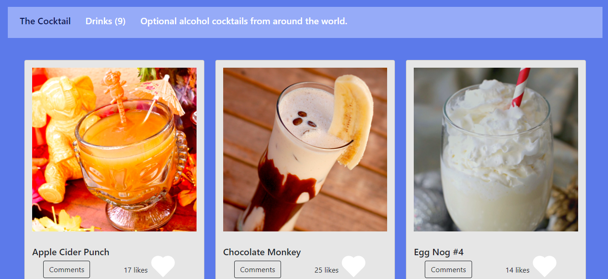

# The Cocktail

> We made our web application based on [TheCocktailDB API](https://www.thecocktaildb.com/api.php);

## Built With

- HTML5
- CSS3
- JavaScript
- Webpack
- Bootstrap
- Jest
  
## Live Demo

[Live Demo Link](https://rocio01.github.io/TheCocktail/)
  

## Getting Started

To get a local copy up and running follow these simple example steps.

### Setup and Install

- Clone this repository using the link above (click on the 'code' button)
- Open a terminal and `cd` to the cloned repository
- run `npm install`
- run`npm run start` to open a live server in your preferred browser

### Test
- run `npm test`

### Usage

-  A home page showing a list of coktails that you can "like."
- A popup window with more data about each coktail that you can use to comment on it or reserve it for a period of time.

### Deployment

- Deployed on GitHub Pages

## Author

👤  **Rocio Martinez** 
- Github: [@Rocio01](https://github.com/Rocio01) 
- Twitter: [@rugiada8801](https://twitter.com/rugiada8801) 
- Linkedin: [zulma-rocio-martinez](https://www.linkedin.com/in/zulma-rocio-martinez) 
  
👤 **Ajayi Peter**

- GitHub: [@githubhandle](https://github.com/peterdgreat)
- Twitter: [@twitterhandle](https://twitter.com/dev_Peter_O)
- LinkedIn: [LinkedIn](https://linkedin.com/in/ajayi-peter-4391ab1b5)

## 🤝 Contributing

Contributions, issues, and feature requests are welcome!

Feel free to check the [issues page](https://github.com/Rocio01/To-Do-list/issues).

## Show your support

Give a ⭐️ if you like this project!

## Acknowledgments

- Microverse

## 📝 License

This project is [MIT](LICENSE) licensed.
